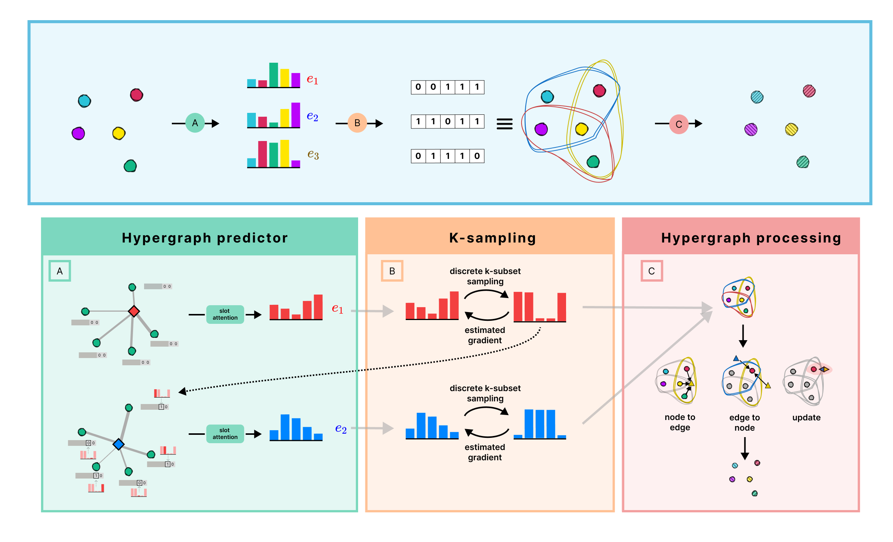

# SPHINX: Structural Prediction using Hypergraph Inference Network

This is the official code for the SPHINX model as introduced in [SPHINX: Structural Prediction using Hypergraph Inference Network](https://arxiv.org/abs/2410.03208).

<div align="center">
  
</div>

## Citation

Please use the following BibTeX to cite our work.

```
@inproceedings{
duta2025sphinx,
title={{SPHINX}: Structural Prediction using Hypergraph Inference Network},
author={Iulia Duta and Pietro Lio},
booktitle={Forty-second International Conference on Machine Learning},
year={2025},
url={https://openreview.net/forum?id=sfQJrVb4XM}
}
```

Note: The code for generating the NBA dataset is based on the repository from: https://github.com/MediaBrain-SJTU/GroupNet/tree/main. 
The code for the differentiable k-subset sampling is based on: https://github.com/uclnlp/torch-imle, https://github.com/EdinburghNLP/torch-adaptive-imle and https://github.com/UCLA-StarAI/SIMPLE

We would like to thank all the authors of the above papers for their work and for making the code available. 

## Enviroment requirement
The required env is stored in: environment.yml


## Overview

`hypergraph_predictor.HypergraphpPredictorSeq(...)` -- generates the hypergraph structure (the discrete incidence matrix) based on the observed trajectory x

`models.*` -- contains various hypergraph neural networks used for hypergraph processing (AllDeepSets, HGNN, HCHA)

`slot_attention_seq.SlotAttention(...)` -- is the slot attention clusterisation used to predict the soft incidence matrix

`samplers.*` -- contains the code asscoiated to the k-subset sampling algorithms (AIMLE, IMLE and SIMPLE)

`slot_attention.SlotAttention(...)` and `hypergraph_predictor.HypergraphPredictor(...)` -- classes used for the non-sequential ablations


## How to run the model

E.g. the general pipeline for using SPHINX is:

```
model_predictor = HypergraphPredictorSeq(...)
model = HGNN(...)

# predict the incidence matrix
edge_index, edge_weights, H = model_predictor(x_ons) # H: bs x num_edges x num_nodes

# batch the incidence matrix in pytorch geometric format
H = torch.permute(torch.block_diag(*torch.unbind(H, dim=0)), (1,0) # H: num_edges_batch x num_nodes_batch

# use H in your hypergraph processor
y = model(x, H)
```

## Prepare Datasets

The synthetic datasets used in our experiments are attached in ./datasets/
For the NBA dataset, please follow the instructions in https://github.com/MediaBrain-SJTU/GroupNet/tree/main

## Example of script to run one experiment on Two-Triangles dataset

For running SPHINX on the synthetic Particle Simulation dataset:
```
CUDA_VISIBLE_DEVICES=0 python main_unsup.py --dataset=two_triangles --num_slots=2 --slot_k=3 --selection_type=simple --sequential=True --model_type=AllDeepSets  --ld=10 --lr=0.001 --num_epochs=1000  --add_self_loop=True
```
For running SPHINX on the NBA dataset:
```
CUDA_VISIBLE_DEVICES=0 python main_unsup_nba.py --MLP_hidden=256 --MLP_norm=ln --MLP_num_layers=3 --add_self_loop=True --add_velocity=True --batch_size=128 --connectivity=learned --dataset=nba --deterministic=False --enc_len=5 --encoder_type=MLP --imle_beta=10 --ld=10 --logits_activation=logsigmoid --long_history=False --lr=0.001 --model_type=AllDeepSetsOrig --noise_distribution=sog --num_epochs=300 --num_iter=2 --num_layers=2 --num_slots=5  --selection_type=aimle --slot_k=4 --slot_nonlin=sparsemax --tag=hyperparameter_tuning
```


